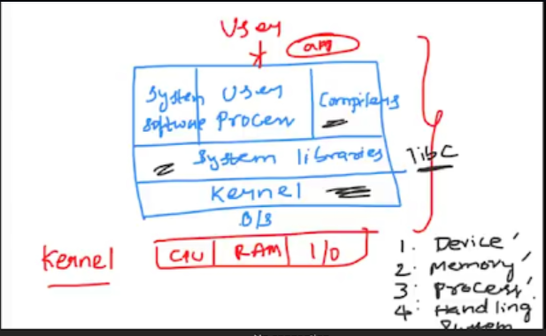
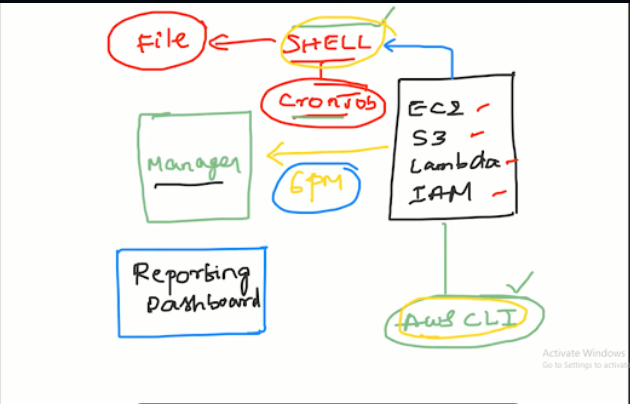

# Topic __ Shell Scripting


## Operating System
- OS is an intermediary between your software application (python, jenkins, chrome) and hardware components (cpu, ram, io) 
- Linux is free (opensource), secure & fast
- Kernel is the heart of OS. It performs following duties. Device management, Memory management, Process management, Handling system calls. 


### Linux useful commands
- ls
- ls -la 
- ls -ltr
- cp
- mv
- vim
- pwd
- cd
- mkdir
- rm -rf
- cat new_file
- vi new_file
- touch new_file
- echo 'Hello aqeel' >> new_file
- bash --version
- date
- top 
- free -g
- nproc
- lscpu
- htop
- cat /proc/cpuinfo
- df -h
- history
- clear (ctrl + l)
- mv my_script.sh Downloads/
- man
- man ls
- vi my_script.sh 
- cat my_script.sh 
- cat log_file | grep ERROR
- ./my_script.sh
- chmod +x my_script.sh 
- chmod -x my_script.sh 
- chmod 777 my_script.sh 
- sh my_script.sh 
- bash my_script.sh 
- ps 
- grep 

- | (# pipe) (pipe command sends the output of one command to next command) (but this does not applies to the system default commands like "date". for example ( date | echo "date is" )

- ps -ef   (# list all processes running on the system)
- ps -ef | grep "python"  # list all processes that have "python" keyword in them.
- awk
- ps -ef | grep "python" | awk -F" " '{print $2}'     (# list all processes that have "python" keyword in them. and then list only the 2nd column)

- grep name test_file   ( # inside the test_file, list the lines which have "name" keyword in them.)
- grep name test_file | awk -F" " '{print $2}'    
- curl
- curl google.com
- curl -X GET google.com
- wget 
- wget google.com
- curl google.com | grep ERROR
- find / -name requirements.txt    (# find the requirements.txt in all the system )
- sudo su -    (# switch to root user)
- su aqeel     (# switch to aqeel user)
- kill -9 java
- kill -9 1221   (1221 is process id)


### Wget vs Curl
- wget download the file and then you can use grep to see the data
- curl directly get the data from the API


### Linux Signals
- trap   (it traps the signals like (ctrl + C) and perform the execution on your behalf)
- trap "echo don't use the ctrl+c" SIGINT^C   (if someone uses ctrl+c, don't allow him and give him this message)
- trap "rm -rf *" SIGINT^C    (remove everything in someone press ctrl+c)


### What is the purpose of Shebang ? ( /bin/sh vs /bin/bash )
- #!/bin/bash (always use this)
- #!/bin/sh (previously it refers to /bash (that's why both /sh and /bash were used interchangeably ), but now in some distros like ubuntu, it refers to /dash)


### chmod - Permissions ( owner | group | all users ) (r = 4, w = 2, x = 1)

### Script to list all processes
ps -ef 

### Script to print only errors from a remote log
- curl google.com | grep ERROR

### how will you debug the shell script
- set -x
- set -e
- set -o

### What is crontab
- job scheduling at regular intervals

### how to open a read-only file
- vim -r test.txt

### difference btw soft and hard link
- when you create and save a file, it gets saved in the memory. now if you want to re-use this file, you can create a copy of it in the form of hard-link.
- python refers to python3 when we use it on windows machine. here "python" is soft-link to "python3"

### break vs continue
- break - breaks the execution cycle
- continue - skip this and continue the loop with next

### is bash dynamically or statically typed
- its dynamic in nature 
- x = 5, x = 'string'

### Explain about a network troubleshooting utility
- traceroute google.com
- tracepath google.com

### how will you sort list of names in a file
- sort

### How will you manage logs of a system that generates huge log files everyday?
- logrotate (gzip, zip)


###  if-else loop
```bash
a = 2
b = 3

if [$a > $b]
then
       echo "a is greater"
else
       echo "b is greater"
fi
```


### for-loop
```bash
for i in {1.100};
do
    echo $1; 
done
```


### Example-0: Shell Scripting Basics
- One of the key responsibilities of a DevOps engineer is to track the usage of cloud resources. Scripting is used for this purpose.

- BASIC BASH SCRIPT 

```bash
#!/bin/bash
echo "my name is aqeel"
#create a folder and create two files inside 
mkdir huchi
cd huchi
touch first_file second_file
```


### Example-1: Check the node health 
```bash
#!/bin/bash
# Author: Aqeel
# Date: 03/07/2024
# This script outputs the node health
# Version: v1
# check the system memory usage, disk space & no. of CPU running 
set -x   # debug mode
set -e    # exists the script when there is an error
set -o pipefail    # exists the script when there is an error in the pipe command line
df -h
free -g
nproc
```


### Example-2: Print numbers divided by 3 & 5 and not 15
```bash
# !/bin/bash
# Author: Aqeel
# Date: 05/07/2024 
# This script outputs the number divisible by 3 & 5 and not 15
# Version: v1
##############

set -x   # debug mode
set -e    # exists the script when there is an error
set -o pipefail    # exists the script when there is an error in the pipe command line
for i in {1.100}; do
if ([ `expr $i % 3` == 0 ] || [ `expr $i % 5` == 0 ] && [ `expr $i % 15` != 0 ]);
then
        echo $i
fi;
done
```


### Example-3: Print numbers of "S" in mississipi
```bash
#!/bin/bash
# Author: Aqeel
# Date: 05/07/2024
# This script outputs the total occurrences of letter "S" in mississipi
# Version: v1
set -x   # debug mode
set -e    # exists the script when there is an error
set -o pipefail    # exists the script when there is an error in the pipe command line
x = mississipi
grep -o "s" <<<"$x" | wc -l
```


## 💥 Project-1
- Write a script to report the usage of AWS resources in your project? You can integrate this script with Cronjob, and then cronjob will execute the script at your specified date and time.

### Launch an Ec2 instance
- sudo apt-get update

### Install  & setup Aws CLI

curl "https://awscli.amazonaws.com/awscli-exe-linux-x86_64.zip" -o "awscliv2.zip"
- unzip awscliv2.zip
- sudo ./aws/install
- aws --version

### Security keys
- aws configure

### Shell Script
- vi aws_resource_tracker.sh
- chmod 755 aws_resource_tracker.sh
- ./aws_resource_tracker.sh | more

++++++++++++++++++++++ aws_resource_tracker.sh ++++++++++++
```bash
#!/bin/bash
# Author: Aqeel
# Date: 05/07/2024
# This script reports the AWS resource usage
# Aws s3
# Aws Ec2
# Aws Lambda
# Aws IAM User
# Version: v1
set -x   # debug mode
set -e    # exists the script when there is an error
set -o pipefail    # exists the script when there is an error in the pipe command line

# list s3 buckets
echo "Print list of s3 buckets"
aws s3 ls

# list ec2 instances
echo "Print list of ec2 instances"
aws ec2 describe-instances | jq " .Reservations.Instances.InstanceId "

# list lambda functions
echo "Print list of lambda functions"
aws list lambda-functions

# list IAM users
echo "Print list of IAM users"
aws iam list-users
```


### Schedule a job using CRONTAB
- crontab -e
- */5 * * * * /path/to/myscript.sh >> /path/to/outputfile.txt   (runs after every 5 minute) (>> will append in the previous data)
- chmod +x myscript.sh
- crontab -l
- cat /path/to/outputfile.txt


## 💥 Project-2 (Github API Integration)
- Write a script to list people who have access to a particular repository on Github.
- You need your (username + access token) as a prerequisite. You can generate a new classic token from "Developer Settings" section on your github account. 
- Make sure you have access to the target repository.

### Export your github username & token 
- export username = "YOUR GITHUB USERNAME"
- export token = "YOUR GITHUB TOKEN"

### Shell Script
++++++++++++++++++++++ list_users.sh ++++++++++++
```bash
#!/bin/bash

# GitHub API URL
API_URL="https://api.github.com"
# GitHub username and personal access token
USERNAME=$username
TOKEN=$token

# User and Repository information
REPO_OWNER=$1
REPO_NAME=$2

# Function to make a GET request to the GitHub API
function github_api_get {
    local endpoint="$1"
    local url="${API_URL}/${endpoint}"

    # Send a GET request to the GitHub API with authentication
    curl -s -u "${USERNAME}:${TOKEN}" "$url"
}

# Function to list users with read access to the repository
function list_users_with_read_access {
    local endpoint="repos/${REPO_OWNER}/${REPO_NAME}/collaborators"

 # Fetch the list of collaborators on the repository
collaborators="$(github_api_get "$endpoint" | jq -r '.[] | select(.permissions.pull == true) | .login')"

    # Display the list of collaborators with read access
 if [[ -z "$collaborators" ]]; then
        echo "No users with read access found for ${REPO_OWNER}/${REPO_NAME}."
    else
        echo "Users with read access to ${REPO_OWNER}/${REPO_NAME}:"
        echo "$collaborators"
    fi
}
```

### Main script
- echo "Listing users with read access to ${REPO_OWNER}/${REPO_NAME}..."
- list_users_with_read_access


### Execution Command
- chmod 111 list_users.sh
- sudo apt install jq
- ./list_users.sh YOUR_ORGANIZATION_NAME YOUR_REPO_NAME

<br>

### Lecture Snaps

<br>

<br>


