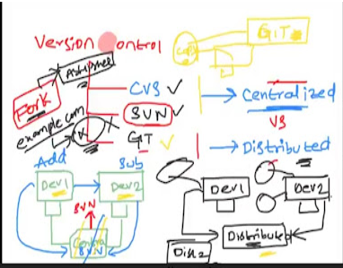
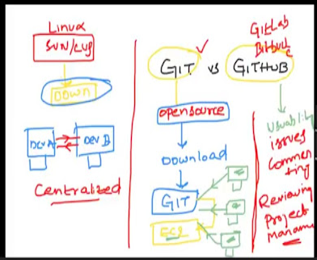
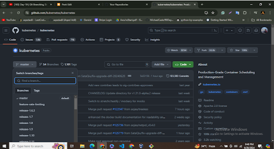
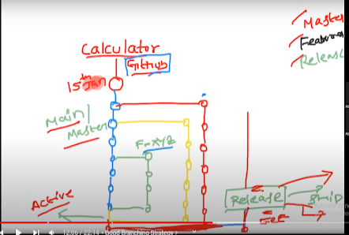
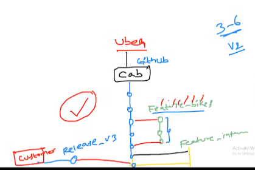

# Topic __ Git & Github (Version control)

 

### Centralized vs Distributed version control? 
- Git is a distributed version control system
- In centralized system like SVN or CVS, there was a single point of failure. If the centralized version-control system goes down, the developers will not be able to share their code with each other. 
- Distributed Systems like git allows the individual developers to share the copies of their code with others, which we call forking.
- Github is a cloud storage platform for storing the project code.

### Git useful commands
- git init
- git add test.txt
- git status
- git commit -m 'First commit'
- git diff
- git log
- git reset --hard <commit id>
- git push -u origin main

### Git Branching Strategy 
- Kubernetes repo has close to 3300 contributors.
https://github.com/kubernetes/kubernetes

- Lets consider a calculator app with functionalities (add, sub, mul, div). and now you want to add some new feature like percentage. For this, you will create a new branch , write code created to percentage feature in it, test it and then merge it into main/master branch of calculator app.

1. Master Branch:
   - It is for active development. It must be kept up-to-date
2. Featured Branches: 
   - Where developers work on new features. and when testing is done, they merge with the master branch.
3. Release Branch:
   - It is the branch which is the latest updated version of master branch & which is delivered to the customer.
4. Hot-fix Branch:
   - When customer faces some issue and you had to immediately fix them

### Thanks to freeCodeCamp community for this resource 
https://www.freecodecamp.org/news/git-and-github-for-beginners/
 
- git --version
- git config --global user.name "aqeeladil"
- git config --global user.email "aqeel.adil17@gmail.com"
- git config --list
- echo "# mytodolist" >> README.md
- touch .gitignore    
 
- git init   
- git add .   
- git status 
- git commit -m "Initial commit"  
- git branch -M main  (it renames the branch's name to "main". The default branch might be created as "master", but "main" is the standard name for this repo now )

- ssh -keygen -t rsa -b 4096 -C "aqeel.adil17@gmail.com"    (You may need to add thsi step if you are a windows user and your repo is in Private mode. In the end, copy the public key and paste it to the github profile ssh key section.)
- git remote add origin <github_ssh_path>  
- git remote -v 
- git push origin main  
- git push -u origin main  

### In case you cloned the repo from github to local machine
- git clone <github_https_path> 
- git add <file_name>
- git commit -m "Initial commit"

### you can simply use : "git push origin", this will push it to its default branch
- git push origin main    

### EXTRAS

- git clone <github_https_path>   #to clone any remote github repo into our local machine
- git clone <github_https_path> </folder_name>     #Clone the repository to a folder:
- git log     #To view the history of commits for a repository, you can use the log command:
- git log branch_name   # to view branch specific commit history
- git log --oneline
- git command -help   #See all the available options for the specific command
- git status help    #Show the possible options for the status command in command line:
- git help --all     #See all possible command
- git add -A     #Stage all new, modified, and deleted files. Use the shorthand command
- git commit -a -m "initial commit" #Commit the updated files directly, skipping the staging environment:   #"-a" can be used before "-m" to directly commit an updated file without repeating the whole process of "git add" 
- git status --short   #Check the compact version of the status for repository
- git branch            #to check the existing branches
- git branch <branch_name>   #to create a new branch 
- git checkout child1    # to switch to the child branch
- git checkout -b child2    # Using the -b option on checkout will create a new branch, and move to it, if it does not exist
- git cherry-pick <commit_hash>   # to merge a specific commit
- git rebase 
- git merge child2     #merge the current branch (main) with child2:

### Question: git merge vs git rebase vs git cherry-pick 
- with git merge, commit changes of current branch got updated after the main branch commits.
- with git rebase, commit changes of current branch got updated before the main branch commits.
- git cherry-pick is only helpful when u want to merge 1 or 2 commits. 

###
- git branch -d child2 (to delete child2 branch from the local repository)
- git fetch origin  (updates our local repo) (Get all the change history of the origin for this branch)
- git merge origin/main  (it merge's our local branch with the origin-main branch that exists on github)
- git pull origin    (pull is a combination of fetch and then merge. It is used to pull all changes from a remote repository into the branch you are working on.)
- git branch -r   #remote branches only
- git branch -a    #List all local and remote branches of the current Git.
- git diff <branch_name>    #to compare commits, branches, files & more
- git merge <branch_name>   #to merge two branches . t will merge this given branch with our current branch
- git pull origin main    #to fetch and download content from a remote repo & immediately update the local repo to match that content
- git push origin   #push the current branch to its default remote origin:

- git remote rename origin upstream
- *.temp      #In .gitignore add a line to ignore all .temp files
- temp/       #In .gitignore add a line to ignore all files in any directory named temp:
- temp?.log   #In .gitignore add a single line to ignore all files named temp1.log, temp2.log, and temp3.log:
- *.log
- !main.log   #In .gitignore, ignore all .log files, except main.log:
- git remote set-url origin git@abc.com:x/y.git    #Replace the remote URL for origin with x/y.git on abc.com using SSH:
- git log --oneline     #Show the log of the repository, showing just 1 line per commit:
- git revert HEAD   #revert the latest commit:
- git revert HEAD --no-edit   #revert the latest commit, skipping the commit message editor:
- git revert HEAD~1    #revert the two last commits:
- git reset abc123   #reset to the commit with the hash abc1234
- git commit --amend -m "Update index"

### UNDOING CHANGES IN GIT

### Case-1 - Staged Changes (which are added but not commited yet)
- git reset <file_name>
- git reset  #this command applies on all files

### Case-2 - Commited Changes (for one commit)
- git reset HEAD-1   #HEAD is the latest commit in git. '1' means go one step back

### Case3 - Commited changes (for many commits)
- git reset <commt hash>   #move back to this commit  #every commit has a unique hash
- git reset --hard <commt hash>    #this command not only removes the changes from github/git, but also from our local vsCode setup 

### Extras
- PULL REQUESTS
- MERGE CONFLICTS
- FORK (fork is a rough copy of original repo. It is a new repo that shares code & visibility settings with the original upstream repo)
- Clone vs Fork ?

 

### Lecture Snaps

 

 

 

 

 

 
